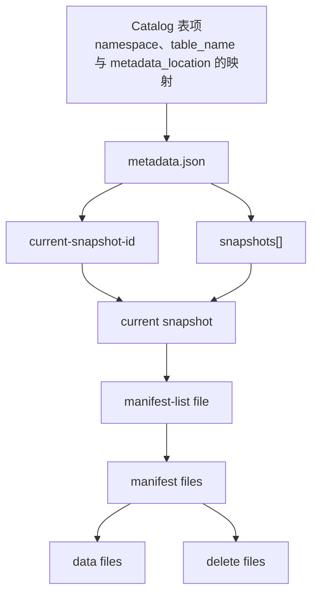

# openGauss Iceberg Catalog 元信息表设计

## 1. 文档目标

本文定义 openGauss 首期 Iceberg Catalog 元信息表设计，聚焦以下内容：

1. Iceberg 原生元信息的结构与边界。
2. 哪些元信息落表，哪些不落表。
3. 各表的建表语句、字段含义、与 Iceberg 元数据文件的对应关系。
4. 待确认项及其适用场景。

本文只讨论 Schema 设计，不展开升级机制、执行流程和运维细节。

## 2. 设计范围

本文覆盖以下元信息对象：

| 对象 | 设计范围 |
| --- | --- |
| Namespace | Namespace 标识及扩展属性 |
| Internal Table | 本地 relation 绑定表的目录记录、当前 metadata 指针和顶层高频摘要 |
| Schema | `schemas[]` 的版本与字段定义 |
| Partition Spec | `partition-specs[]` 的版本与字段定义 |
| Snapshot | `snapshots[]` 的高频摘要 |

首期不包含：

1. 多 Catalog 隔离。
2. 审计体系。
3. 业务索引元信息。
4. Manifest / Data File 明细落表。
5. 完整回滚与历史恢复机制。

此外，本文在后文补充 Spark / PyIceberg 通过 JDBC Catalog 直连 openGauss 场景下的 external 目录表扩展设计。

## 3. 设计原则

1. `metadata.json` 及其引用链路是唯一权威元信息。
2. 数据库只缓存高频、稳定、结构化的摘要信息。
3. 能直接展开的高频结构优先展开，不保留整段 JSON。
4. Schema 设计优先围绕 Iceberg 原生元信息展开。
5. Internal / external 目录记录物理分表，避免在本地 relation 绑定模型中混入大量空字段。

## 4. Iceberg 元信息与缓存边界

### 4.1 文件链路



### 4.2 元信息分类

从 Schema 设计视角，可将 Iceberg 元信息分为以下几类：

| 分类 | 典型内容 | 设计处理方式 |
| --- | --- | --- |
| Catalog 对象元信息 | Namespace、Internal Table identifier、`metadata_location` 及兼容字段 | 独立落表 |
| 表级顶层摘要 | `table-uuid`、`location`、`last-column-id`、当前版本指针 | 缓存到 `tables_internal` |
| 高频版本结构 | `schemas[]`、`partition-specs[]`、`snapshots[]` | 拆分为结构化子表 |
| 开放或低频顶层信息 | `properties`、`sort-orders`、`refs`、`snapshot-log`、`metadata-log` | 不独立落表，保留在完整 metadata 中 |
| 下层文件链路信息 | Manifest List 内容、Manifest File、Data File、Delete File 明细 | 首期不落表 |

### 4.3 原生元信息落表去向总览（Internal 表）

| 原生字段 | 处理方式 |
| --- | --- |
| `table-uuid` | 缓存到 `tables_internal.table_uuid` |
| `location` | 缓存到 `tables_internal.table_location` |
| `last-column-id` | 缓存到 `tables_internal.last_column_id` |
| `schemas` | 展开到 `table_schemas` |
| `schemas[].identifier-field-ids` | 不落表，保留在完整 metadata 中 |
| `current-schema-id` | 缓存到 `tables_internal.current_schema_id` |
| `partition-specs` | 展开到 `partition_specs` |
| `default-spec-id` | 缓存到 `tables_internal.default_spec_id` |
| `current-snapshot-id` | 缓存到 `tables_internal.current_snapshot_id` |
| `snapshots` | 高频摘要缓存到 `snapshots` |
| `snapshots[].summary.total-records` | 缓存到 `snapshots.total_records` |
| `snapshots[].parent-snapshot-id` | 不落表，保留在完整 metadata 中 |
| `snapshots[].sequence-number` | 不落表，保留在完整 metadata 中 |
| `snapshots[].first-row-id` | 不落表，保留在完整 metadata 中 |
| `format-version` | 不落表，保留在完整 metadata 中 |
| `last-updated-ms` | 不落表，按需识别 |
| `last-partition-id` | 不落表，按需识别 |
| `last-sequence-number` | 不落表，按需识别 |
| `sort-orders` / `default-sort-order-id` | 不落表，保留在完整 metadata 中 |
| `properties` | 不落表，保留在完整 metadata 中 |
| `snapshot-log` / `metadata-log` / `refs` | 不落表，保留在完整 metadata 中 |
| `statistics` / `partition-statistics` / `next-row-id` | 不落表，按需识别 |
| Manifest List 内容 / Manifest File / Data File / Delete File 明细 | 不落表，按需识别 |

说明：`previous_metadata_location` 属于 JDBC Catalog 兼容字段，不对应 `metadata.json` 原生字段，因此不在本节单列。Spark / PyIceberg 通过 JDBC Catalog 直连 openGauss 的 external 表扩展场景放在后文单独说明。

## 5. 表设计

| 表 | 简短说明 |
| --- | --- |
| `namespaces` | 保存 Namespace 标识及其扩展属性。 |
| `tables_internal` | 保存本地 relation 绑定表的目录记录、当前 metadata 指针和顶层高频摘要。 |
| `table_schemas` | 保存 `schemas[]` 的版本与字段定义。 |
| `snapshots` | 保存 `snapshots[]` 的高频摘要信息。 |
| `partition_specs` | 保存 `partition-specs[]` 的版本与字段定义。 |

### 5.1 `namespaces`

```sql
CREATE TABLE iceberg_catalog.namespaces (
    namespace   TEXT PRIMARY KEY,
    properties  JSONB NOT NULL DEFAULT '{}'::JSONB,
    CHECK (jsonb_typeof(properties) = 'object')
);
```

`namespaces` 对应 Catalog 层 Namespace 对象，不对应 `metadata.json` 内部结构。

| 字段 | 类型 | 含义 | Iceberg 对应 |
| --- | --- | --- | --- |
| `namespace` | `TEXT` | Namespace 唯一标识 | Namespace name |
| `properties` | `JSONB` | Namespace 扩展属性 | Namespace properties |

说明：`properties` 仅保存对象级扩展属性，不拆为属性子表。

### 5.2 `tables_internal`

```sql
CREATE TABLE iceberg_catalog.tables_internal (
    relid                 REGCLASS NOT NULL,
    namespace             TEXT NOT NULL,
    table_name            TEXT NOT NULL,
    table_uuid            UUID NOT NULL,
    metadata_location     TEXT NOT NULL,
    previous_metadata_location TEXT,
    table_location        TEXT NOT NULL,
    last_column_id        INT NOT NULL,
    current_schema_id     INT,
    current_snapshot_id   BIGINT,
    default_spec_id       INT,
    PRIMARY KEY (namespace, table_name),
    UNIQUE (table_uuid),
    UNIQUE (relid),
    FOREIGN KEY (namespace)
        REFERENCES iceberg_catalog.namespaces(namespace)
        ON DELETE RESTRICT
);
```

`tables_internal` 对应一张本地 relation 绑定 Iceberg 表的顶层 `metadata.json` 摘要，以及 Catalog 层表标识。

| 字段 | 类型 | 含义 | Iceberg 对应 |
| --- | --- | --- | --- |
| `relid` | `REGCLASS` | 本地 openGauss relation 标识 | 无 |
| `namespace` | `TEXT` | 表所属 Namespace | Table identifier.namespace |
| `table_name` | `TEXT` | 表名 | Table identifier.name |
| `table_uuid` | `UUID` | 表稳定唯一标识 | `metadata.json.table-uuid` |
| `metadata_location` | `TEXT` | 当前 metadata 文件指针 | Catalog pointer |
| `previous_metadata_location` | `TEXT` | 上一版本 metadata 文件指针 | JDBC Catalog 兼容字段 |
| `table_location` | `TEXT` | 表根路径 | `metadata.json.location` |
| `last_column_id` | `INT` | 当前最大列 ID | `metadata.json.last-column-id` |
| `current_schema_id` | `INT` | 当前 Schema 指针 | `metadata.json.current-schema-id` |
| `current_snapshot_id` | `BIGINT` | 当前 Snapshot 指针 | `metadata.json.current-snapshot-id` |
| `default_spec_id` | `INT` | 当前默认 Partition Spec 指针 | `metadata.json.default-spec-id` |

说明：`relid` 用于将 Catalog 表记录与本地 openGauss relation 做稳定关联，因此在 internal 表中要求非空。`previous_metadata_location` 用于兼容 JDBC Catalog 表形状，保存上一版本 metadata 文件指针。`current_schema_id`、`current_snapshot_id`、`default_spec_id` 当前不建数据库外键，是因为三者都属于当前版本指针；其中 `table_schemas` 与 `partition_specs` 采用版本化展开结构，`snapshots` 虽然已独立成表，但当前仍与前两者保持一致的指针建模策略，不额外引入跨列复合外键，而由写入事务保证一致性；其中 `current_snapshot_id` 还需与完整 metadata 中的 `refs.main` 保持一致。`last_column_id` 建议保留，因为首期已明确支持加列。

### 5.3 `table_schemas`

```sql
CREATE TABLE iceberg_catalog.table_schemas (
    table_uuid       UUID NOT NULL,
    schema_id        INT NOT NULL,
    field_position   INT NOT NULL,
    field_id         INT NOT NULL,
    field_name       TEXT NOT NULL,
    field_required   BOOLEAN NOT NULL,
    field_type       TEXT NOT NULL,
    field_doc        TEXT,
    PRIMARY KEY (table_uuid, schema_id, field_position),
    UNIQUE (table_uuid, schema_id, field_id),
    FOREIGN KEY (table_uuid)
        REFERENCES iceberg_catalog.tables_internal(table_uuid)
        ON DELETE CASCADE,
    CHECK (field_position >= 0)
);
```

`table_schemas` 对应 `metadata.json.schemas[]` 中的单个 Schema 对象。完整对象通常包含：`type`、`schema-id`、`identifier-field-ids`、`fields[]`；其中 `fields[]` 包含：`id`、`name`、`required`、`type`、`doc`。

| 字段 | 类型 | 含义 | Iceberg 对应 |
| --- | --- | --- | --- |
| `table_uuid` | `UUID` | 所属表 | `metadata.json.table-uuid` |
| `schema_id` | `INT` | Schema 版本 ID | `metadata.json.schemas[].schema-id` |
| `field_position` | `INT` | 字段顺序 | `metadata.json.schemas[].fields[]` 顺序 |
| `field_id` | `INT` | 字段稳定 ID | `metadata.json.schemas[].fields[].id` |
| `field_name` | `TEXT` | 字段名 | `metadata.json.schemas[].fields[].name` |
| `field_required` | `BOOLEAN` | 必填标记 | `metadata.json.schemas[].fields[].required` |
| `field_type` | `TEXT` | 类型字符串表示 | `metadata.json.schemas[].fields[].type` |
| `field_doc` | `TEXT` | 字段说明 | `metadata.json.schemas[].fields[].doc` |

说明：`field_type` 保存 Iceberg 类型的字符串表示，当前不继续递归拆表。当前设计默认每个 Schema 至少包含一条实际字段记录，不单独为空 Schema 预留占位记录。

### 5.4 `snapshots`

```sql
CREATE TABLE iceberg_catalog.snapshots (
    table_uuid          UUID NOT NULL,
    snapshot_id         BIGINT NOT NULL,
    schema_id           INT,
    timestamp_ms        BIGINT NOT NULL,
    manifest_list       TEXT,
    total_records       BIGINT,
    PRIMARY KEY (table_uuid, snapshot_id),
    FOREIGN KEY (table_uuid)
        REFERENCES iceberg_catalog.tables_internal(table_uuid)
        ON DELETE CASCADE
);
```

`snapshots` 对应 `metadata.json.snapshots[]` 中的单个 Snapshot 对象。完整对象通常包含：`sequence-number`、`snapshot-id`、`schema-id`、`parent-snapshot-id`、`timestamp-ms`、`manifest-list`、`summary`。

| 字段 | 类型 | 含义 | Iceberg 对应 |
| --- | --- | --- | --- |
| `table_uuid` | `UUID` | 所属表 | `metadata.json.table-uuid` |
| `snapshot_id` | `BIGINT` | Snapshot ID | `metadata.json.snapshots[].snapshot-id` |
| `schema_id` | `INT` | Snapshot 对应的 Schema 版本 | `metadata.json.snapshots[].schema-id` |
| `timestamp_ms` | `BIGINT` | 生成时间 | `metadata.json.snapshots[].timestamp-ms` |
| `manifest_list` | `TEXT` | Manifest List 路径 | `metadata.json.snapshots[].manifest-list` |
| `total_records` | `BIGINT` | 当前 Snapshot 的总记录数摘要 | `metadata.json.snapshots[].summary.total-records` |

说明：`schema_id` 建议保留。Iceberg Snapshot 原生对象可包含可选 `schema-id`，即使首期暂不直接使用，也便于后续做历史 Schema 关联分析。

### 5.5 `partition_specs`

```sql
CREATE TABLE iceberg_catalog.partition_specs (
    table_uuid      UUID NOT NULL,
    spec_id         INT NOT NULL,
    field_position  INT NOT NULL,
    field_id        INT,
    source_id       INT,
    field_name      TEXT,
    transform       TEXT,
    PRIMARY KEY (table_uuid, spec_id, field_position),
    UNIQUE (table_uuid, spec_id, field_id),
    FOREIGN KEY (table_uuid)
        REFERENCES iceberg_catalog.tables_internal(table_uuid)
        ON DELETE CASCADE,
    CHECK (
        (field_position = -1
            AND field_id IS NULL
            AND source_id IS NULL
            AND field_name IS NULL
            AND transform IS NULL)
        OR
        (field_position >= 0
            AND field_id IS NOT NULL
            AND source_id IS NOT NULL
            AND field_name IS NOT NULL
            AND transform IS NOT NULL)
    )
);
```

`partition_specs` 对应 `metadata.json.partition-specs[]` 中的单个 Partition Spec 对象。完整对象通常包含：`spec-id`、`fields[]`；其中 `fields[]` 包含：`source-id`、`field-id`、`name`、`transform`。

| 字段 | 类型 | 含义 | Iceberg 对应 |
| --- | --- | --- | --- |
| `table_uuid` | `UUID` | 所属表 | `metadata.json.table-uuid` |
| `spec_id` | `INT` | Partition Spec 版本 ID | `metadata.json.partition-specs[].spec-id` |
| `field_position` | `INT` | 字段顺序；`-1` 表示版本占位记录 | `metadata.json.partition-specs[].fields[]` 顺序 |
| `field_id` | `INT` | Partition Field ID | `metadata.json.partition-specs[].fields[].field-id` |
| `source_id` | `INT` | 源列 ID | `metadata.json.partition-specs[].fields[].source-id` |
| `field_name` | `TEXT` | 分区字段名 | `metadata.json.partition-specs[].fields[].name` |
| `transform` | `TEXT` | 分区变换表达式 | `metadata.json.partition-specs[].fields[].transform` |

说明：当前默认 Spec 由 `tables_internal.default_spec_id` 保存，不在本表重复保存默认标记。

### 5.6 兼容视图

为兼容 JDBC Catalog 形状，可在当前主线物理表之上暴露以下两张兼容视图。视图不引入新的物理存储，仅对现有表做兼容层映射。

```sql
CREATE OR REPLACE VIEW iceberg_catalog.iceberg_tables AS
SELECT
    'default'::TEXT AS catalog_name,
    namespace AS table_namespace,
    table_name,
    metadata_location,
    previous_metadata_location
FROM iceberg_catalog.tables_internal;

CREATE OR REPLACE VIEW iceberg_catalog.iceberg_namespace_properties AS
SELECT
    'default'::TEXT AS catalog_name,
    n.namespace,
    p.key AS property_key,
    p.value AS property_value
FROM iceberg_catalog.namespaces n
CROSS JOIN LATERAL jsonb_each_text(n.properties) AS p(key, value);
```

说明：

1. `iceberg_tables` 暴露 JDBC Catalog 兼容形状所需的基础字段。
2. `iceberg_namespace_properties` 将 `namespaces.properties` 展开为行式属性视图。
3. 主线兼容视图默认仅覆盖 internal 表。

## 6. External 扩展设计

本章讨论 Spark / PyIceberg 通过 JDBC Catalog 直连 openGauss 的扩展场景。该场景不改变前文 internal 主线建模，仅额外补充 external 目录表与兼容视图。

### 6.1 `tables_external`

```sql
CREATE TABLE iceberg_catalog.tables_external (
    namespace                  TEXT NOT NULL,
    table_name                 TEXT NOT NULL,
    metadata_location          TEXT NOT NULL,
    previous_metadata_location TEXT,
    PRIMARY KEY (namespace, table_name),
    FOREIGN KEY (namespace)
        REFERENCES iceberg_catalog.namespaces(namespace)
        ON DELETE RESTRICT
);
```

`tables_external` 对应仅通过当前 Catalog 管理、但没有本地 openGauss relation 绑定的外部表目录记录。典型场景包括 Spark / PyIceberg 通过 JDBC Catalog 创建的表。

| 字段 | 类型 | 含义 | Iceberg 对应 |
| --- | --- | --- | --- |
| `namespace` | `TEXT` | 表所属 Namespace | Table identifier.namespace |
| `table_name` | `TEXT` | 表名 | Table identifier.name |
| `metadata_location` | `TEXT` | 当前 metadata 文件指针 | Catalog pointer |
| `previous_metadata_location` | `TEXT` | 上一版本 metadata 文件指针 | JDBC Catalog 兼容字段 |

说明：`tables_external` 仅保存目录记录和 metadata 指针，不建立本地 relation，也不在数据库中物化 Schema、Partition Spec 和 Snapshot 摘要缓存。`table_uuid`、`table_location`、`current_schema_id`、`current_snapshot_id`、`default_spec_id` 等字段当前不进入 `tables_external`；如需获取，按需从 `metadata_location` 指向的 `metadata.json` 解析。这样可以保持 external 路径的最小目录模型，避免在外部写入方每次提交后都同步刷新数据库侧高频缓存。同一 `(namespace, table_name)` 在当前 Catalog 中只能存在于 `tables_internal` 或 `tables_external` 之一，该约束由写入事务保证。

### 6.2 兼容视图扩展

如启用 external 扩展，可将 `iceberg_tables` 视图扩展为同时暴露 `tables_internal` 与 `tables_external`。

```sql
CREATE OR REPLACE VIEW iceberg_catalog.iceberg_tables AS
SELECT
    'default'::TEXT AS catalog_name,
    namespace AS table_namespace,
    table_name,
    metadata_location,
    previous_metadata_location
FROM iceberg_catalog.tables_internal
UNION ALL
SELECT
    'default'::TEXT AS catalog_name,
    namespace AS table_namespace,
    table_name,
    metadata_location,
    previous_metadata_location
FROM iceberg_catalog.tables_external e
WHERE NOT EXISTS (
    SELECT 1
    FROM iceberg_catalog.tables_internal i
    WHERE i.namespace = e.namespace
      AND i.table_name = e.table_name
);

CREATE OR REPLACE VIEW iceberg_catalog.iceberg_namespace_properties AS
SELECT
    'default'::TEXT AS catalog_name,
    n.namespace,
    p.key AS property_key,
    p.value AS property_value
FROM iceberg_catalog.namespaces n
CROSS JOIN LATERAL jsonb_each_text(n.properties) AS p(key, value);
```

说明：

1. `iceberg_tables` 在 external 扩展场景下同时暴露 internal 与 external 目录记录。
2. `iceberg_namespace_properties` 保持不变，继续复用主线定义。
3. 兼容视图优先暴露 internal 记录；如出现同名 internal / external 目录记录，external 记录在视图层被隐藏。
4. 如需对外暴露到固定 Schema，可在部署阶段再将视图发布到目标 Schema。
5. 如需兼容 external Catalog 的写入、更新和删除目录记录，可在 `iceberg_tables` 视图上通过 `INSTEAD OF` trigger 将 DML 分发到 `tables_external`。

## 7. internal / external 能力范围

### 7.1 Internal 表目标支持范围

| 操作类型 | openGauss | Spark / PyIceberg / JDBC Catalog |
| --- | --- | --- |
| 发现表 | 支持 | 支持 |
| 查询数据 | 支持，作为本地 relation 查询 | 支持，按 `metadata_location` 读取 |
| 创建表 | 支持，创建后落入 `tables_internal` | 不支持 |
| 写入 / commit | 支持 | 不支持 |
| Schema 变更 | 支持当前设计范围内的 Schema 变更 | 不支持 |
| Drop / unregister | 支持 | 不支持 |
| 更新 Catalog pointer | 支持 | 不支持 |

### 7.2 External 表目标支持范围

| 操作类型 | openGauss | Spark / PyIceberg / JDBC Catalog |
| --- | --- | --- |
| 发现表 | 支持，通过 `iceberg_tables` 查看目录记录 | 支持 |
| 查询数据 | 默认不直接支持；如显式创建外表或其他读取入口，可支持查询 | 支持，按 Iceberg 标准读取 |
| 创建目录记录 | 可支持，通过兼容视图写入 | 支持，目录记录落入 `tables_external` |
| 更新 Catalog pointer | 可支持，通过兼容视图更新 | 支持 |
| 删除 / unregister 目录记录 | 可支持，通过兼容视图删除 | 支持 |
| 写入表数据 / commit | 不支持作为本地写入方 | 支持 |
| Schema 变更提交 | 不支持作为本地提交方 | 支持 |
| 使用数据库侧结构化缓存 | 不支持 | 不适用 |

说明：

1. Internal 表面向 openGauss 本地表能力，支持 relation 绑定和高频元信息缓存。
2. External 表面向 Catalog 目录兼容能力，仅用于记录表标识和 metadata 指针，不缓存 `table_uuid`、`table_location` 和当前版本摘要。
3. openGauss 可通过兼容视图维护 external 目录记录，但当前不作为 external 表的数据写入方和 Schema 提交方。
4. External 表如需在 openGauss 中查询数据，需要后续单独建立读取入口；本文不展开该部分设计。
5. 以上表格描述的是当前 schema 对应的目标支持范围，不等同于完整运行时实现状态。

## 8. 与 `pg_lake` 元信息 Schema 的对比

### 8.1 总体差异

| 维度 | `pg_lake` | 当前方案 |
| --- | --- | --- |
| 表目录建模 | `tables_internal` / `tables_external` 分离 | `tables_internal` / `tables_external` 分离 |
| Namespace 属性 | `namespace_properties` 行式存储 | `namespaces.properties` JSONB |
| 表当前指针 | 保留 `metadata_location`，并保留 `previous_metadata_location` | 保留 `metadata_location`，并保留 `previous_metadata_location` |
| 本地表绑定 | 直接依赖 `regclass` | 保留 `relid` 作为本地 relation 标识 |
| 结构缓存重点 | 更偏 relation / runtime / 文件级管理 | Internal 表缓存 Catalog 顶层摘要与高频结构；External 表仅保存目录指针 |
| 同名 internal / external 冲突处理 | 视图层隐藏 `catalog_name = current_database()` 的 external 记录 | 约束同一 `(namespace, table_name)` 只能出现在 internal 或 external 之一，兼容视图额外隐藏冲突 external 记录 |

### 8.2 结论

`pg_lake` 更偏向“本地 relation 生命周期 + 文件级 runtime 管理”；当前方案沿用 internal / external 分表思路，但将数据库侧高频缓存收敛在 internal 表路径。

## 9. 与原有 openGauss 方案对比

### 9.1 `tables_internal`

| 差异项 | 原有 openGauss 方案 | 当前方案 |
| --- | --- | --- |
| `namespace` | 无 | 有 |
| `relid` | 无 | 有 |
| `previous_metadata_location` | 无 | 有 |
| `last_column_id` | 无 | 有 |
| `default_spec_id` | 无 | 有 |
| `last_updated_ms` | 有 | 无 |

### 9.2 `tables_external`

| 差异项 | 原有 openGauss 方案 | 当前方案 |
| --- | --- | --- |
| 独立 external 目录表 | 无 | 有 |
| 本地 relation 绑定 | 无 | 无 |
| 保存内容 | 无 | `metadata_location`、`previous_metadata_location` |

### 9.3 `table_schemas`

| 差异项 | 原有 openGauss 方案 | 当前方案 |
| --- | --- | --- |
| `table_name` | 有 | 无 |
| `field_position` | 无 | 有 |

### 9.4 `snapshots`

| 差异项 | 原有 openGauss 方案 | 当前方案 |
| --- | --- | --- |
| `table_name` | 有 | 无 |
| `total_records` | 无 | 有 |

### 9.5 `partition_specs`

| 差异项 | 原有 openGauss 方案 | 当前方案 |
| --- | --- | --- |
| `table_name` | 有 | 无 |
| `field_position` | 无 | 有 |

### 9.6 `manifest` / `datafile`

原有 openGauss 方案已下沉到 `manifest` 和 `datafile` 级别；当前方案首期仍收敛在 `tables_internal`、`tables_external`、`table_schemas`、`snapshots`、`partition_specs` 五类高频结构，不扩展到文件明细层。

## 10. 结论

1. `metadata.json` 仍然是唯一权威元信息。
2. 首期主线落表对象为 `namespaces`、`tables_internal`、`table_schemas`、`partition_specs`、`snapshots`。
3. 针对 Spark / PyIceberg 通过 JDBC Catalog 直连 openGauss 的扩展场景，可额外引入 `tables_external` 与兼容视图。
4. `sort-orders`、`properties`、`refs`、`snapshot-log`、`metadata-log` 等内容保留在完整 metadata 中，不单独落表。
